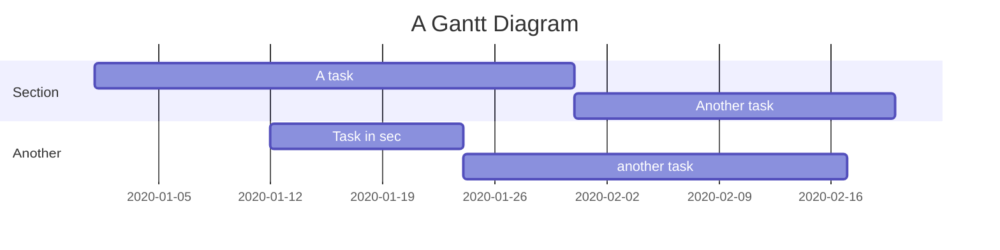

```mermaid
gantt
	title A Gantt Diagram
	dateFormat  DD-MM-YYYY
	section Section
	A task           :a1, 01-01-2020, 30d
	Another task     :after a1  , 20d
	section Another
	Task in sec      :12-01-2020  , 12d
	another task      : 24d
```